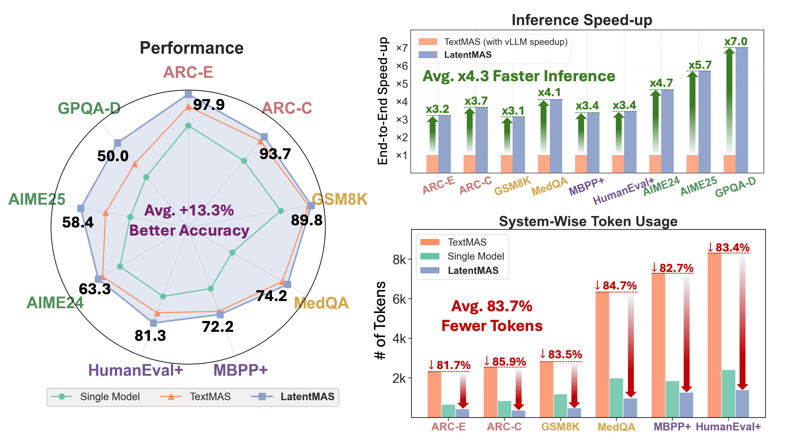
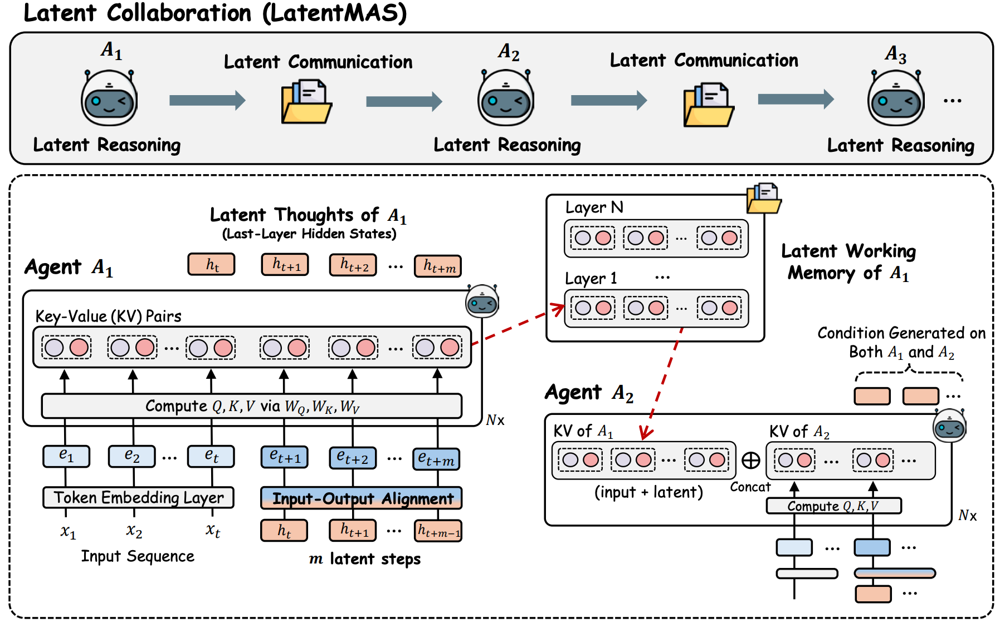
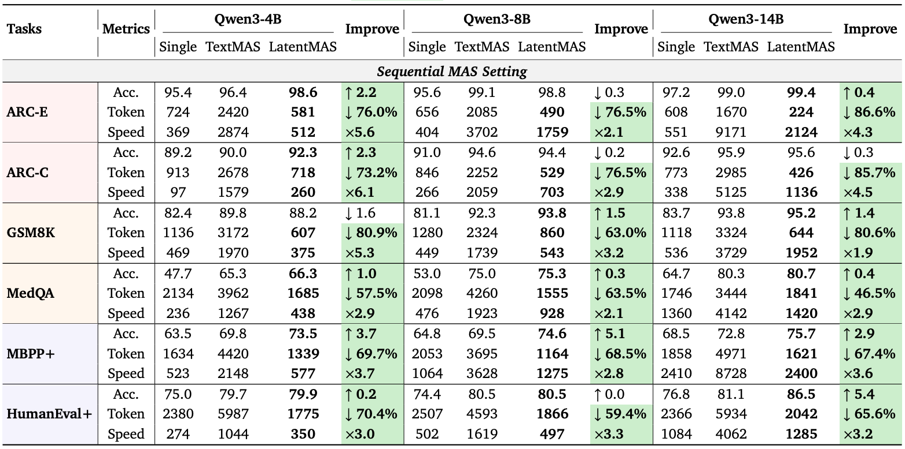
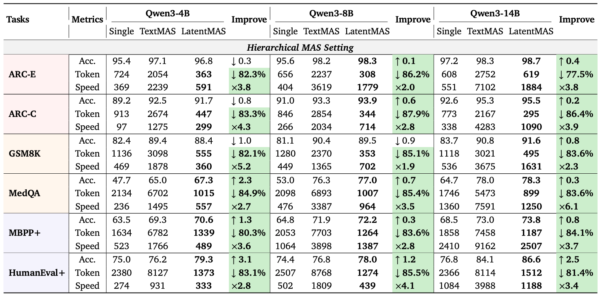
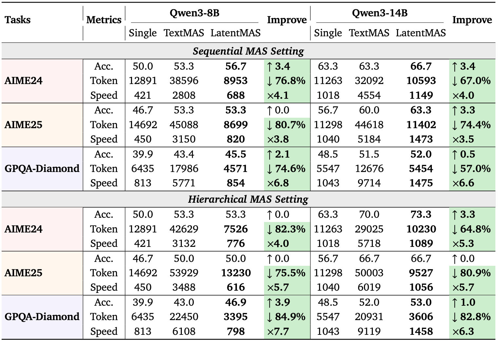

<a name="readme-top"></a>

<p align="center">
  <picture>
    <source media="(prefers-color-scheme: dark)" srcset="assets/logo.png">
    
  </picture>
</p>

<h3 align="center">
Latent Collaboration in Multi-Agent Systems
</h3>


<p align="center">
    <a href="https://arxiv.org/abs/2511.20639"></a>
    <a href="https://github.com/Gen-Verse/LatentMAS/blob/main/assets/LatentMAS_slides.pdf"></a>
    <a href="https://huggingface.co/papers/2511.20639"></a>
    <a href="https://x.com/Jiaru_Zou/status/1994724438135169196"></a>
    <a href="https://github.com/Gen-Verse/LatentMAS/tree/Science-LatentMAS"></a>
</p>

---

<p align="center">
  
</p>

## 💡 Introduction


**LatentMAS** is a multi-agent reasoning framework that **moves agent collaboration from token space into the model’s latent space**.  
Instead of producing long textual reasoning traces, agents communicate by **passing latent thoughts** through their own **working memory**. LatentMAS has the following key features:

- **Efficient** multi-step reasoning with drastically fewer tokens  
- **Training-free** latent-space alignment for stable generation  
- **A general technique** compatible with **any HF model** and optionally **vLLM** backends.

Overall, LatentMAS achieves **superior performance**, **lower token usage**, and **major wall-clock speedups** of the multi-agent system.

<p align="center">
  
</p>


## 🔔 News
- **[2026-05-01]** LatentMAS has been accepted into ICML 2026 as a **spotlight** ! 
- **[2026-02-26]** 🦞 Check out [**OpenClaw-RL**](https://github.com/Gen-Verse/OpenClaw-RL) from our Gen-Verse group! OpenClaw-RL is a fully asynchronous RL framework that trains personalized AI agents directly from natural conversation feedback — no manual labels, no API keys. It introduces two learning paradigms (Binary RL via GRPO and On-Policy Distillation) and runs the entire stack on your own infrastructure. A great complement to LatentMAS's efficient multi-agent reasoning! 
- **[2025-12-20]** Check [**Science-LatentMAS**](https://github.com/Gen-Verse/LatentMAS/tree/Science-LatentMAS), an excellent extension of LatentMAS developed by Prof. Markus J. Buehler and the [LAMM Lab](https://github.com/lamm-mit) at MIT. Science-LatentMAS is specifically designed for the scientific discovery downstream applications! For more details and instructions, please check our README section "Science-LatentMAS" below and the new `Science-LatentMAS` branch.
- **[2025-12-15]** Check out these amazing community-driven extensions of LatentMAS!
  - **[KNN-LatentMAS](https://github.com/Bookmaster9/kNN-latentMAS)** — Enables more efficient KV utilization for latent memory.
  - **[Hybrid-LatentMAS](https://github.com/nhminle/LatentMAS-Hybrid)** — Extends LatentMAS to support hybrid, heterogeneous multi-agent systems.

- **[2025-11-25]** We have released our paper and code implementations for LatentMAS! Stay tuned for more model-backbone supports and advanced features!
- **[2025-11-25]** We are featured as 🤗 [**HuggingFace 1st Paper of the Day**](https://huggingface.co/papers/2511.20639)!


## 🌐 Awesome Works Built on Top of LatentMAS

Explore community-driven extensions that expand LatentMAS into new domains, architectures, and collaboration patterns:


### 🔬 1. **Science-LatentMAS**
**By Prof. Markus J. Buehler & MIT LAMM Group**  
- **New Branch:** https://github.com/Gen-Verse/LatentMAS/tree/Science-LatentMAS  
- **Original Code:** https://github.com/lamm-mit/LatentMAS/tree/flexible_agents  
**New Features:** Extends LatentMAS for scientific modeling and material-system collaboration, enabling flexible agent types and specialized latent communication for science domains.


### 🧠 2. **KNN-LatentMAS**
**By Bookmaster9**
- **Blog (Overview):** https://bookmaster9.github.io/kNN-latentMAS/  
- **Code:** https://github.com/Bookmaster9/kNN-latentMAS  
- **New Features:** Introduce kNN-based latent retrieval to improve KV-cache usage, boosting memory efficiency and multi-step reasoning stability across agents.

### 🤖 3. **Hybrid-LatentMAS**
**By nhminle**
- **Code:** https://github.com/nhminle/LatentMAS-Hybrid  
- **New Features:** Support heterogeneous/hybrid agent collaboration (LLM + non-LLM agents), enabling modular multi-agent pipelines that mix models, tools, and reasoning strategies.


### 🌍 4. **Awareness Network**
**By Everest-AN**
- **Website:** https://awareness.market/
- **Code:** https://github.com/everest-an/Awareness-Market
- **New Features:** A decentralized AI awareness market product built on LatentMAS research, enabling autonomous agent collaboration and memory sharing.

### 🧩 5. LatentMAS-SLoRA
**By Arifuzzaman Joy**
- **Demo:** https://www.youtube.com/watch?v=g7sxYjwgRRk
- **Code:** https://github.com/Arifuzzamanjoy/latent_mas_slora
- **New Features:** Augment LatentMAS with role-specialized, dynamically switchable LoRA adapters for better specialization and adaptability.

### 🛰️ 6. AVP (Agent Vector Protocol)
**By VectorArc**
- **Blog:** https://blog.avprotocol.ai/avp-binary-protocol-latent-agent-communication/
- **Code:** https://github.com/VectorArc/avp-python
- **New Features:** Enables agents to share KV-cache and hidden states instead of text, supporting zero-training latent handoff, cross-model transfer, and faster multi-agent collaboration.

**If your work extends LatentMAS, feel free to open a PR and we’ll feature it here! 🚀**


## 📊 Experiments Overview

### ⭐ Main Results  
Three main tables from our paper spanning 9 tasks across math & science reasoning, commensonse reasoning, and code generation:

- **Table 1 — LatentMAS under the Sequantial MAS setting**  
  <p align="center"></p>

- **Table 2 — LatentMAS under the Hierarchical MAS setting**  
  <p align="center"></p>

- **Table 3 — Main Results on Reasoning Intensive Tasks**
  <p align="center"></p>


### ⚡ Superior Efficiency on **Time and Tokens**

Overall, LatentMAS reduces:
- **~50–80% tokens**
- **~3×–7× wall-clock time**
compared to standard Text-MAS or chain-of-thought baselines.


## 🛠️ Getting Started

This repository provides all code for reproducing LatentMAS, TextMAS, and baseline single-agent experiments across GSM8K, AIME24/25, GPQA, ARC-Easy/Challenge, MBPP+, HumanEval+, and MedQA.

### ⚙️ Setup Environment Variables

We recommend setting your HF cache directory to avoid repeated downloads:

```bash
export HF_HOME=/path/to/huggingface
export TRANSFORMERS_CACHE=$HF_HOME
export HF_DATASETS_CACHE=$HF_HOME
````

Models and datasets will automatically be downloaded into `$HF_HOME`.


### 📦 Install Packages

```bash
conda create -n latentmas python=3.10 -y
conda activate latentmas

pip install -r requirements.txt
```

If you want **vLLM support**, also install:

```bash
pip install vllm
```

## 🚀 Quick Start

### 1. Clone the repo

```bash
git clone https://github.com/Gen-Verse/LatentMAS.git
cd LatentMAS
```

### 2. Repository Structure

```
LatentMAS/
│── run.py                 # Main entry for experiments
│── models.py              # Wrapper for HF + vLLM + latent realignment
│── methods/
│   ├── baseline.py        # Single-agent baseline
│   ├── text_mas.py        # Token-space multi-agent method
│   └── latent_mas.py      # Latent-space multi-agent (our method)
│── prompts.py             # Prompt constructors
│── data.py                # Dataset loaders
│── data/                  # Provided data + figures (We give medqa.json as an example here)
│── utils.py               # Answer parsing / timeout / helpers
│── example_logs/          # Example logs from LatentMAS
│── requirements.txt
```


## 🧪 Running Experiments (standard HF backend)

### 🔹 **Baseline (single model)**

```bash
python run.py --method baseline --model_name Qwen/Qwen3-14B --task gsm8k --max_samples -1 --max_new_tokens 2048
```


### 🔹 **TextMAS (text based multi-agent system)**

```bash
python run.py --method text_mas --model_name Qwen/Qwen3-14B --task gsm8k --prompt sequential --max_samples -1 --max_new_tokens 2048
```


### 🔹 **LatentMAS (our latent mas method)**

```bash
# 4B example command
python run.py --method latent_mas --model_name Qwen/Qwen3-4B --task gsm8k --prompt sequential --max_samples -1 --max_new_tokens 2048

# 8B example command
python run.py --method latent_mas --model_name Qwen/Qwen3-8B --task gsm8k --prompt sequential --max_samples -1 --max_new_tokens 2048

# 14B example command
python run.py --method latent_mas --model_name Qwen/Qwen3-14B --task gsm8k --prompt sequential --max_samples -1 --max_new_tokens 2048
```

#### Notes:

* **`--latent_steps`** ∈ [0, 80]
  Tune for best performance.
* **`--latent_space_realign`**
  Enables latent→embedding alignment
  We treat this as a **hyperparameter** — enable/disable depending on task/model:

```bash
python run.py --method latent_mas --model_name Qwen/Qwen3-14B --task gsm8k --prompt sequential --max_samples -1 --latent_space_realign --max_new_tokens 2048
```


## 📘 Example Logs

Two example LatentMAS logs are provided for reference purposes:

* `example_logs/qwen3_14b_mbppplus_sequential.txt`
* `example_logs/qwen3_14b_humanevalplus_hierarchical.txt`


Please refer to additional experiment logs [here](https://drive.google.com/drive/folders/1evGv5YAmLb4YM_D9Yu0ABa1nfqHC5N-l?usp=drive_link).
You can open them to view the full agent interaction traces and outputs.


## ⚡ vLLM Integration

LatentMAS supports vLLM for faster inference.

### 🔹 Baseline with vLLM

```bash
python run.py --method baseline --model_name Qwen/Qwen3-14B --task gsm8k --max_samples -1 --use_vllm --max_new_tokens 2048
```

### 🔹 TextMAS with vLLM

```bash
python run.py --method text_mas --model_name Qwen/Qwen3-14B --task gsm8k --prompt sequential --max_samples -1 --use_vllm --max_new_tokens 2048
```

### 🔹 LatentMAS with vLLM

LatentMAS supports a **hybrid HF + vLLM pipeline** for fast inference:
- vLLM handles **final text generation** (with prefix caching, tensor parallelism, etc.)
- A HuggingFace model handles **latent-space rollout** and hidden-state alignment

For this setup, we recommend using two GPUs:
- One GPU for vLLM (`--device`, e.g., `cuda:0`)
- One GPU for the auxiliary HF model (`--device2`, e.g., `cuda:1`)

```bash
CUDA_VISIBLE_DEVICES=0,1 python run.py --method latent_mas --model_name Qwen/Qwen3-14B --task gsm8k --prompt sequential --max_samples -1 --max_new_tokens 2048 \
  --use_vllm \
  --use_second_HF_model \
  --enable_prefix_caching \
  --device2 cuda:1
```

**📍Important Note:**

> vLLM does **not** officially support modifying KV-cache or prompting via latent embeddings.
> We modify the partial inner package inside vLLM backend for our method implementation.
> Note minor numeric differences may arise compared to offical HF backend due to different decoding (generation) strategies. Please Use the HF backend to reproduce the official published results.

## 📚 Citation

💫 If you find **LatentMAS** helpful, please kindly give us a star ⭐️ and cite below. Thanks!

```
@inproceedings{
zou2025latentmas,
  title={Latent Collaboration in Multi-Agent Systems},
  author={Jiaru Zou and Ruizhong Qiu and Gaotang Li and Xiyuan Yang and Katherine Tieu and Pan Lu and Ke Shen and Hanghang Tong and Yejin Choi and Jingrui He and James Zou and Mengdi Wang and Ling Yang},
  booktitle={Forty-third International Conference on Machine Learning},
  year={2026}
}
```

## 🤝 Ackowledgement 

This code is partially based on the amazing work of [vLLM](https://github.com/vllm-project/vllm).
